# YouTube Downloader React App

This is the React front-end for a YouTube downloader application. It allows users to search and convert YouTube videos to MP3 (audio) or MP4 (video) formats and download them in their entire length or just a clip.

## Features

- automatically paste Youtube links from clipboard (if browser allows this functionality)
- directly search for videos within the app
- dynamic action button based on form url
- get real time search suggestions 
- Convert YouTube videos to MP3 or MP4
- recognize chapters in videos
- choose between the whole video or clip a segment from the video
- custom clip by using a slider to select start and end time 
- show chapters on slider for precise video trimming
- see video preview to confirm what you are converting 
- Download converted files directly from the browser
- Progress notifications during conversion and download
- Responsive UI with navigation 

## App Technologies

- react
- react router
- tailwind css
- express server see [back end](../back-end/)


## Project Structure

```
front-end/
  public/
    vite.svg
  src/
    App.jsx           # Main app entry, sets up routing
    main.jsx          # React root rendering
    App.css           # import tailwind styles
    index.css         # tailwind Global styles
    components/
      ActionBtns.jsx  # opens search || video popup
      Header.jsx      # Top navigation/header
      Form.jsx        # Input form for YouTube links with dynamic slider 
      SearchPrev.jsx  # Search preview popup component
      ToggleSwitch.jsx  # toggles slider 
      VideoPrev.jsx   # Video preview popup component
      index.js        # Components barrel export
    pages/
      Layout.jsx          # Layout with context and progress handling
      Home.jsx            # Home page with conversion options
      VideoConverter.jsx  # Video conversion page
      AudioConverter.jsx  # Audio conversion page
      index.js            # Pages barrel export
  index.html
  package.json
  vite.config.js
  eslint.config.js
  .env
  .gitignore
  README.md
```

## Screenshots

### Desktop Screenshots

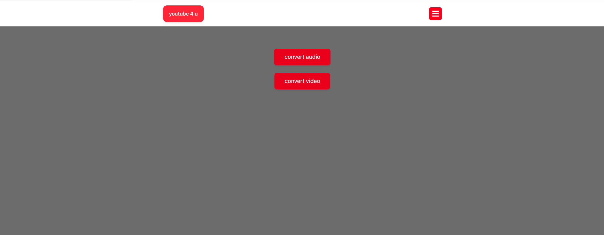
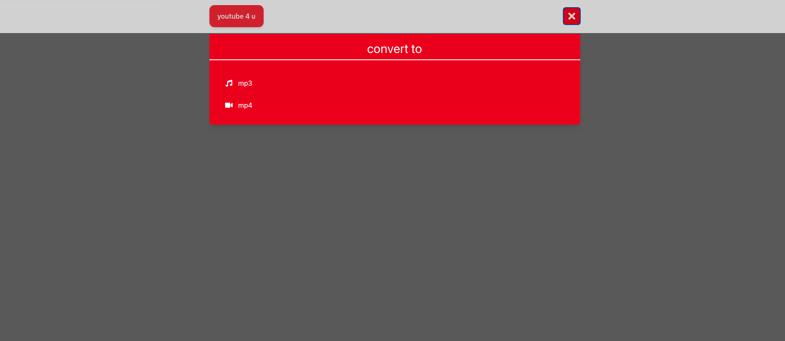
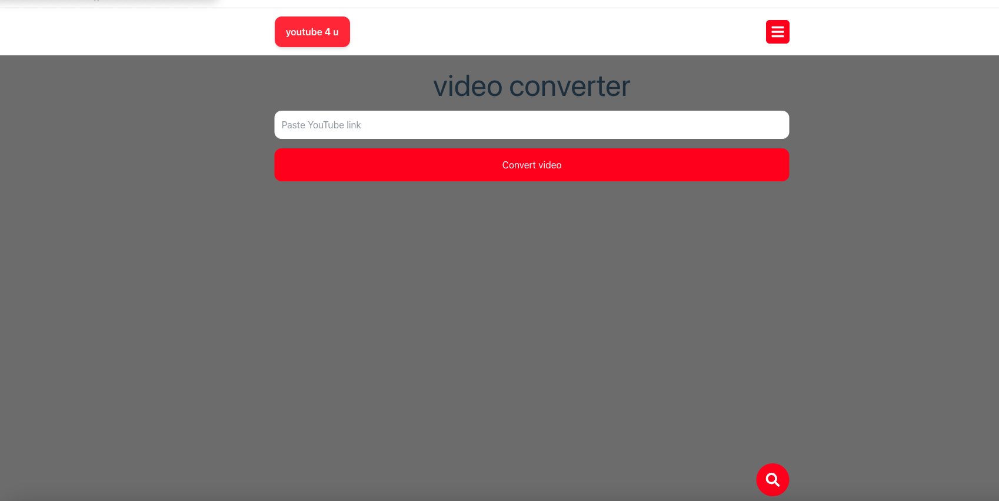
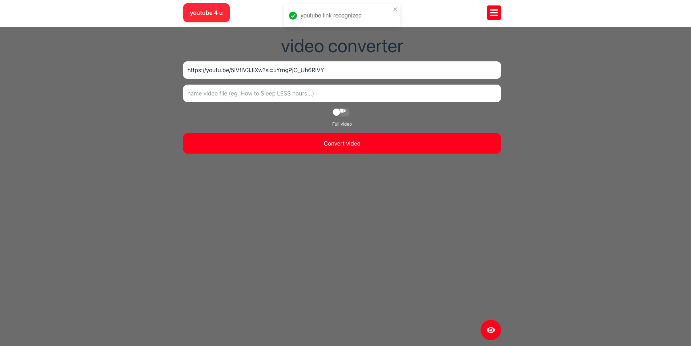
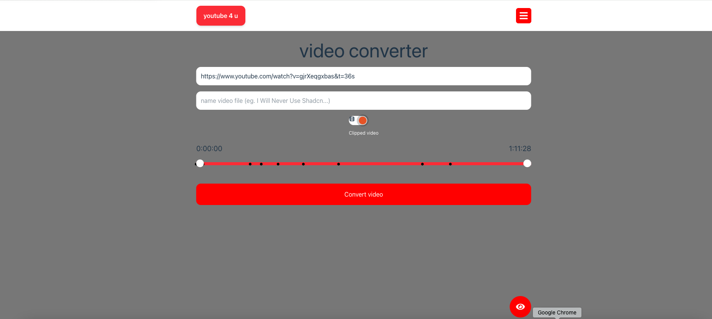
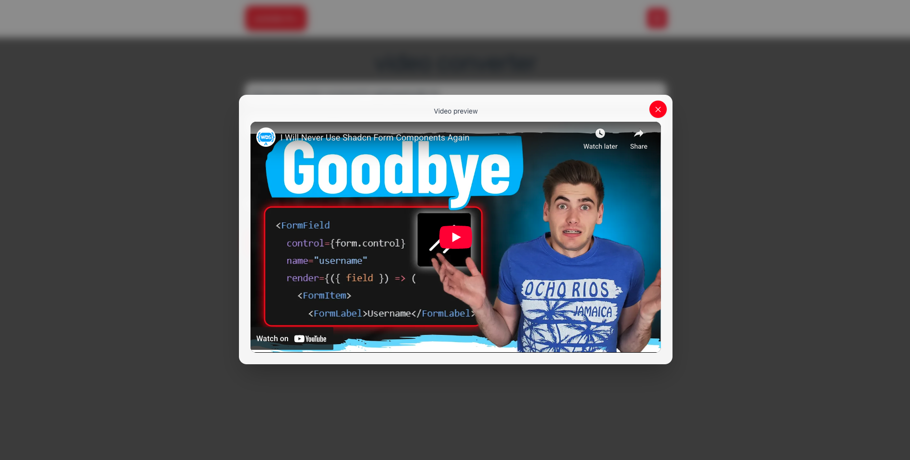
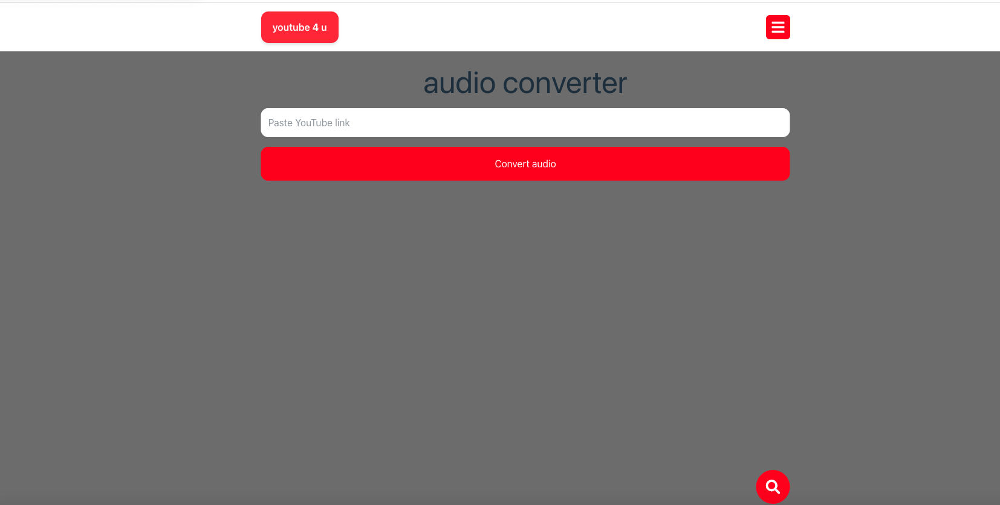
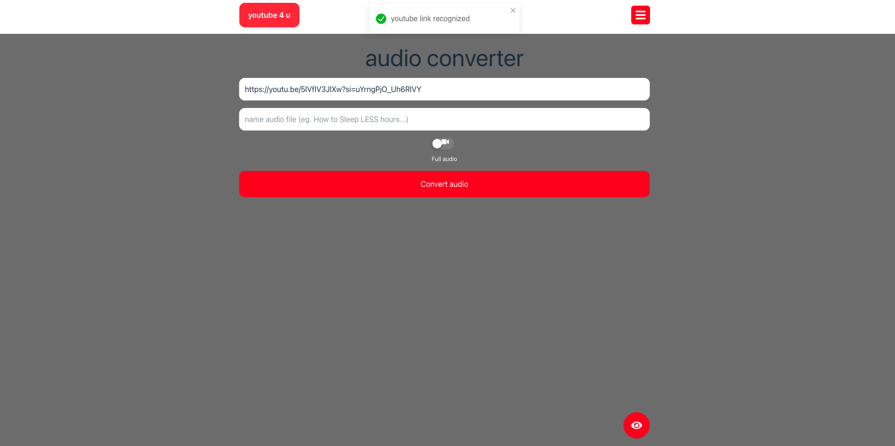
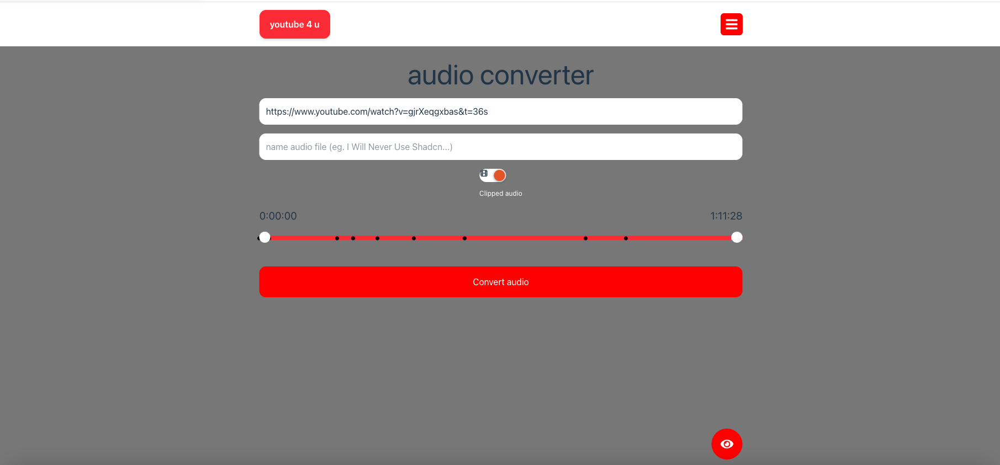
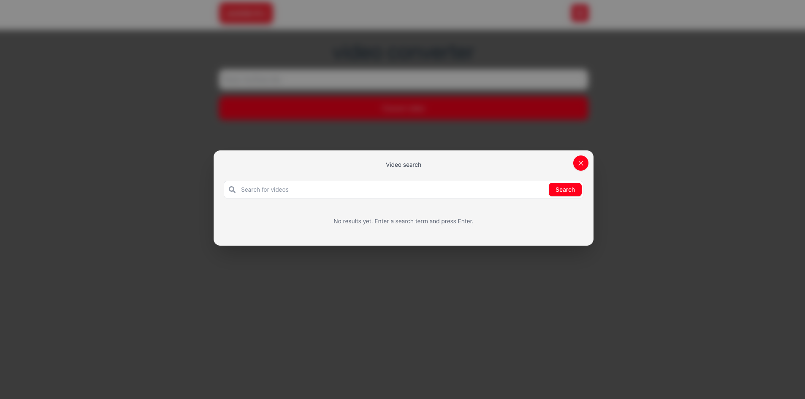

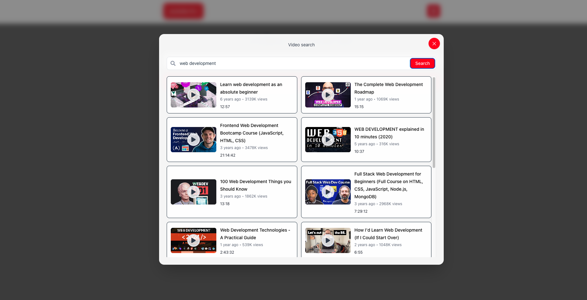

### Mobile Screenshots


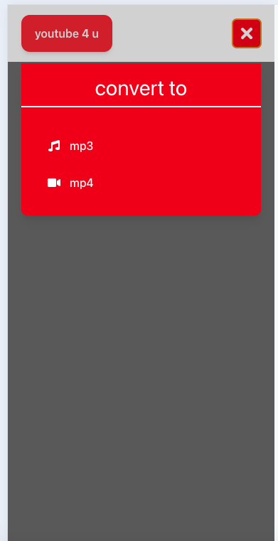
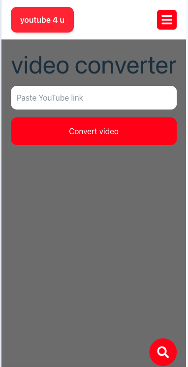
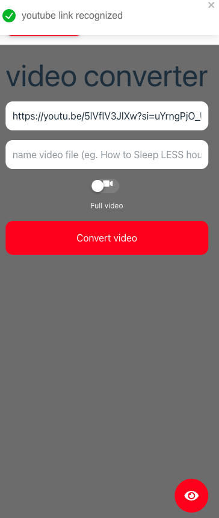
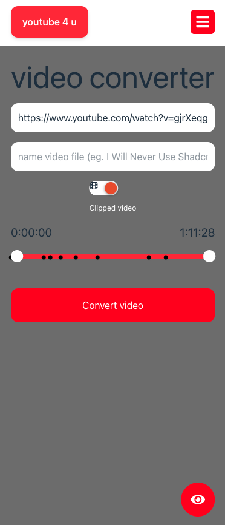
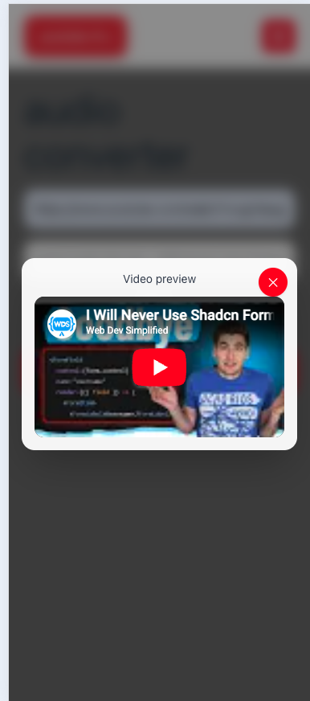
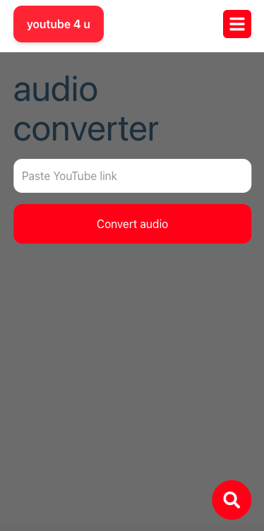
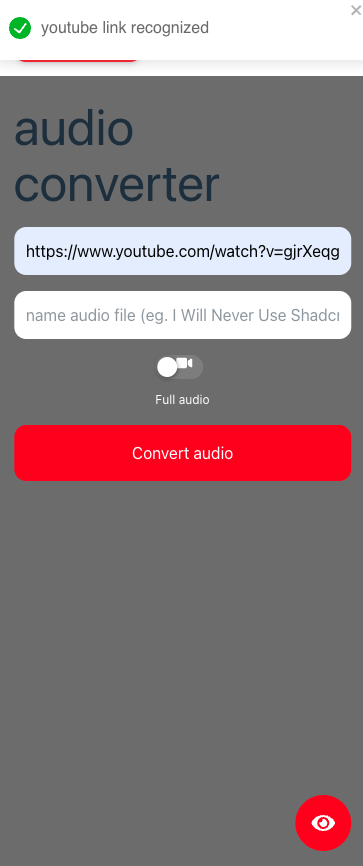
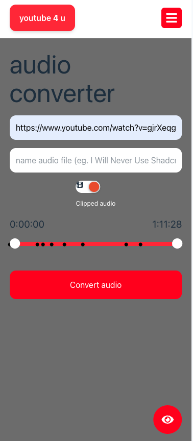
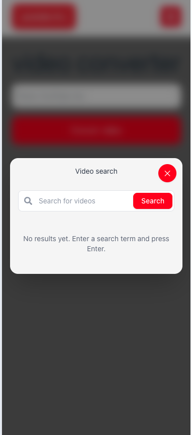
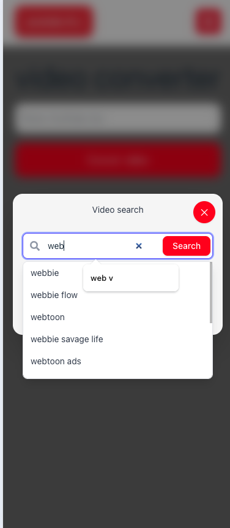
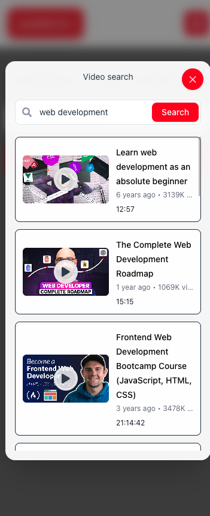

## Live Demos

### Desktop Demo


### Mobile Demo


## Getting Started

### Prerequisites

- Node.js (v18+ recommended)
- The [back-end](../back-end/README.md) server running

### Installation

1. Install dependencies:
   ```sh
   npm install
   ```

2. Set the backend URL in `.env` if needed:
   ```
   VITE_SERVER_URL=http://localhost:3000
   ```

### Running the App

Start the development server:
```sh
npm run dev
```
The app will be available at [http://localhost:5173](http://localhost:5173).

## Usage

1. Paste a YouTube link into the input field.
2. Choose to convert to video (mp4) or audio (mp3).
3. Download the converted file when ready.

## Environment Variables

- `VITE_SERVER_URL`: URL of the backend server (default: `http://localhost:3000`).

## License

MIT

---

This project uses [Vite](https://vitejs.dev/) and [React](https://react.dev/).